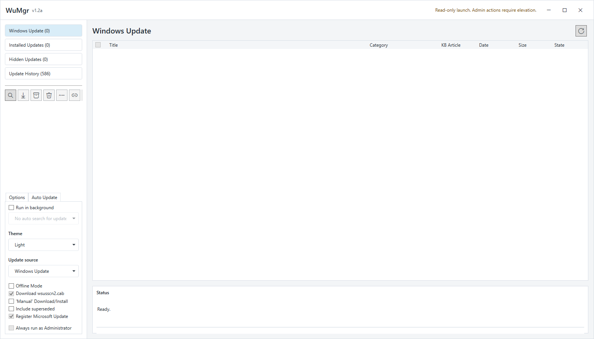
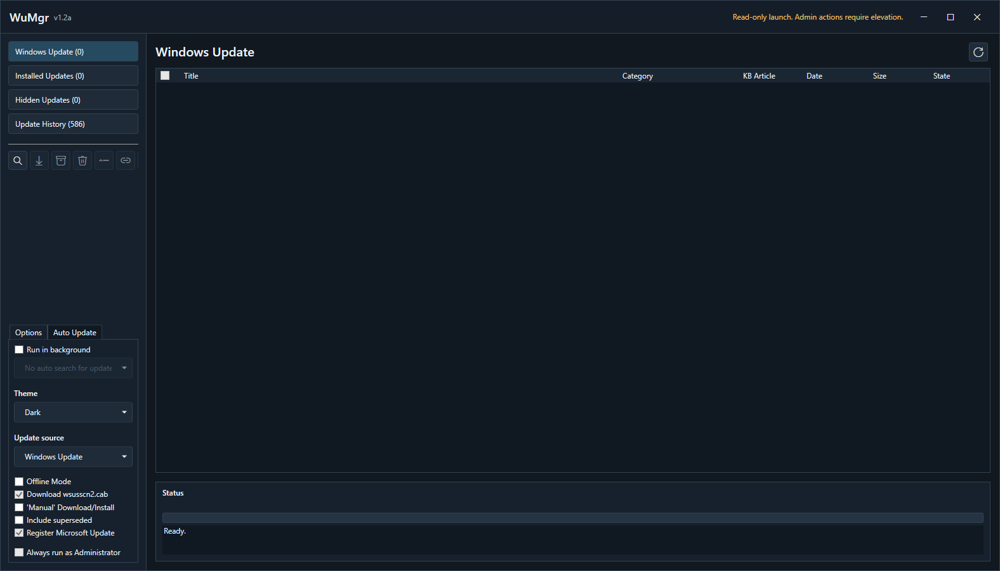

# WuMgr

WuMgr, short for Update Manager for Windows, is a portable Windows Update
manager for Windows 10 and Windows 11. It uses the
[Windows Update Agent API](https://learn.microsoft.com/windows/win32/wua_sdk/portal-client)
to search, download, install, hide, and review Microsoft product updates with
more direct control than the built-in Settings app exposes.

This repository is a public maintained fork of
[DavidXanatos/wumgr](https://github.com/DavidXanatos/wumgr). Fork releases are
published at [Darkaxt/wumgr releases](https://github.com/Darkaxt/wumgr/releases).

## Status At A Glance

| Track | Status | UI | Notes |
| --- | --- | --- | --- |
| Latest packaged release | `v1.2.2` | WPF by default | Current maintained release with the modern shell, read-only launch, and recent security/reliability hardening. |
| Current `master` | Post-release work | WPF by default | Development branch for fixes after `v1.2.2`. |
| Legacy fallback | Available in release and `master` | WinForms | Start with `-winforms` when testing behavior against the original UI. |

Use the release zip when you need a stable portable build. Use current `master`
when you want to test changes that have not been packaged yet.

## Screenshots

The screenshots below show the WPF shell used by the current packaged release.
These captures show the grouped active-update list; categories are selectable
but WuMgr does not auto-skip driver, preview, or other update groups.

| Light theme | Dark theme |
| --- | --- |
|  |  |

## Download And Run

For normal use, download `WuMgr_v1.2.2.zip` from
[Darkaxt/wumgr releases](https://github.com/Darkaxt/wumgr/releases), unzip it
to a writable folder, and run `wumgr.exe`.

Published binaries are unsigned. Windows may show a SmartScreen or publisher
warning until the project has a signed release path. Release archives include
`SHA256SUMS.txt` so downloaded artifacts can be checked after extraction.

For day-to-day usage, see [docs/USAGE.md](docs/USAGE.md).

## Permissions

WuMgr can inspect update state without administrator rights, but changing system
update state requires elevation.

WuMgr starts read-only without a UAC prompt unless Skip UAC was explicitly
configured. Admin-only actions such as download, install, uninstall,
hide/unhide, service changes, GPO changes, and Skip UAC configuration stay
unavailable until WuMgr is launched elevated.

## Features

- Search Windows Update, Microsoft Update, installed updates, hidden updates,
  and update history.
- Download, install, uninstall, hide, unhide, and copy update links from a
  portable executable.
- Configure automatic update policy controls, Microsoft Update registration,
  offline scan mode, manual download mode, and startup behavior.
- Run without elevation for read-only inspection, then restart elevated only
  when using admin-only update or policy actions.
- Use the WPF shell with grouped update categories, compact icon actions, a
  resizable status/log pane, and progress that stays hidden until search,
  download, install, or hide work is running.
- Use `Translation.ini` next to `wumgr.exe` for portable translations.
- Force a UI language with `Lang=` in `wumgr.ini` when Windows regional settings
  should not control the app language.
- Use `-winforms` to compare the WPF shell with the legacy WinForms UI.

## Building From Source

WuMgr targets .NET Framework 4.6.1 and builds on Windows with Visual Studio 2022
or the Visual Studio Build Tools.

```powershell
& "C:\Program Files\Microsoft Visual Studio\2022\Enterprise\MSBuild\Current\Bin\MSBuild.exe" wumgr.sln /restore /p:Configuration=Release /p:Platform="Any CPU" /m
```

Run the focused test harness with:

```powershell
& "C:\Program Files\Microsoft Visual Studio\2022\Enterprise\MSBuild\Current\Bin\MSBuild.exe" wumgr.Tests\wumgr.Tests.csproj /restore /p:Configuration=Debug /p:Platform=AnyCPU
.\wumgr.Tests\bin\Debug\wumgr.Tests.exe
```

See [docs/BUILDING.md](docs/BUILDING.md) for packaging and release commands.

## Documentation

- [User guide](docs/USAGE.md)
- [Build and release commands](docs/BUILDING.md)
- [Options reference](docs/OPTIONS.md)
- [Uninstall and Windows Update recovery](docs/UNINSTALL_AND_RECOVERY.md)
- [Security review notes](docs/SECURITY_REVIEW.md)
- [Upstream issue triage](docs/ISSUE_TRIAGE.md)
- [Upstream pull request triage](docs/UPSTREAM_PR_TRIAGE.md)
- [Modernization notes](docs/MODERNIZATION.md)
- [Security reporting](SECURITY.md)

## Reporting Feedback

Open issues in this fork, not upstream, when testing maintained-fork builds.
Include the WuMgr version, whether you used the packaged release or current
`master`, the selected UI mode, whether the process was elevated, Windows
version, the exact update title or KB when available, and the relevant log text.

For WPF feedback, mention whether the same workflow works with `-winforms`.
That comparison is useful while both shells are available.

## Security Notes

WuMgr touches sensitive Windows Update surfaces: scheduled tasks, Windows Update
services, policy registry keys, manual update downloads, named-pipe IPC, and
optional command hooks. Review [docs/SECURITY_REVIEW.md](docs/SECURITY_REVIEW.md)
before enabling Skip UAC or custom command-hook behavior.

Report vulnerabilities using [SECURITY.md](SECURITY.md). Avoid posting exploit
payloads in public issues.

## Attribution

WuMgr was created by
[DavidXanatos](https://github.com/DavidXanatos) and is inspired by
[Windows Update Mini Tool (WUMT)](https://www.majorgeeks.com/files/details/windows_update_minitool.html).
This fork preserves the original GPLv3 licensing and attribution while
continuing maintenance in `Darkaxt/wumgr`.

To support the original author, this maintained README keeps the Patreon link:
[DavidXanatos on Patreon](https://www.patreon.com/DavidXanatos).

Legacy WinForms icons are provided by [Icons8](https://icons8.com/).
